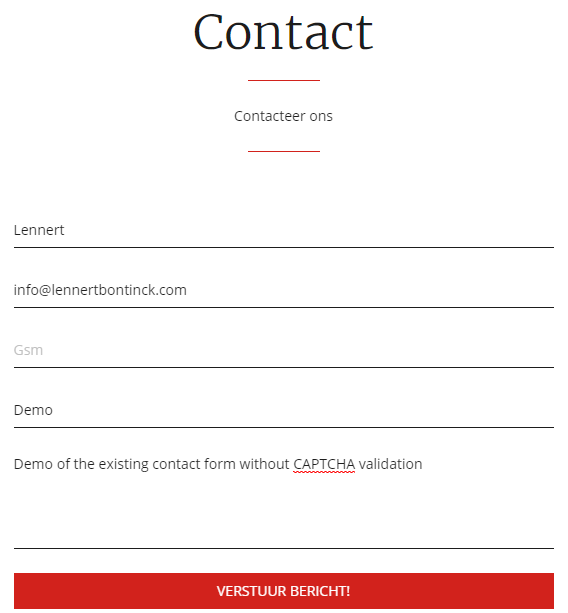

# PHP driven form reCAPTCHA validation tutorial (With AJAX)

This is a small github repo with a step by step tutorial how to implement a Google invisible reCAPTCHA (v2) to an existing php form. 

We will also discuss how you can implement a callback function to trigger what otherwise would be an AJAX call on your contact.php to (eg) hide a contact form after succesfully sending an email and showing a succes message in it's place.

## Inhoudsopgave

> - [Klant](#klant)

## Developer

| Name     | GitHub                        | Email                               |
| :---     | :---                          | :---                                |
| Bontinck Lennert | [GitHub Lennert](https://www.github.com/pikawika) | [info@lennertbontinck.com](mailto:info@lennertbontinck.com) |

## Current setup

We will be changing an existing contact form which uses AJAX to show a succes message after an email is succesfully send. Our environment before implementing reCAPTCHA looks like this:

- initial form
	- <kbd></kbd>
- filled in with optional phone number
	- <kbd></kbd>
- succesfully send 
	- <kbd></kbd>

## Wanted result:

- Keep the contact form easy to use due to an invisible captcha which requires no input most of the time.
- Use a simple image clicking captcha if user is suspected to be a bot.
- Stop a LOT (almost all) of bots from using our php driven (eg contact) form.
- Hide the ugly reCAPTCHA overlay yet will still be allowed by google by adding our own disclaimer.
- Still trigger the previous mentioned ajax function to hide the contact form and show a succes message.

## Getting the required free reCAPTCHA keys:

- Go to [the Recaptcha admin panel](https://google.com/recaptcha/admin).
- Sign in with a google account if not already logged in. You can have multiple free keys on one account
- You should see a form "register a new site"
	- <kbd></kbd>

## Used sources

- [Clean html mail to send using php](https://github.com/pikawika/contact-form-mail-template)