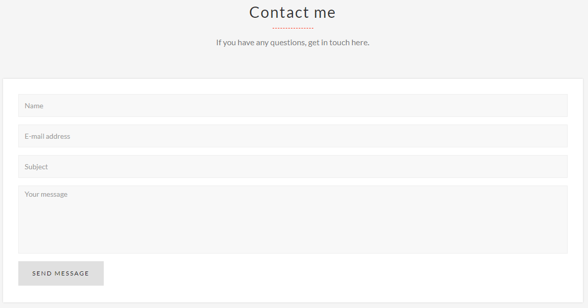
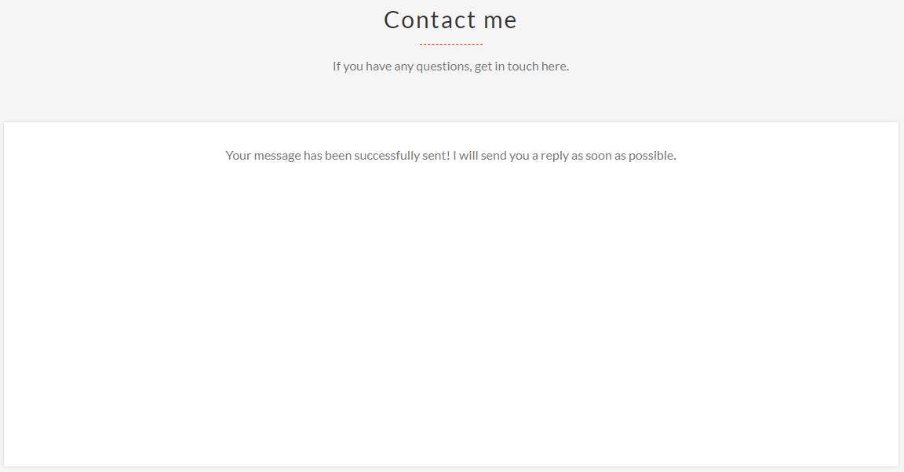
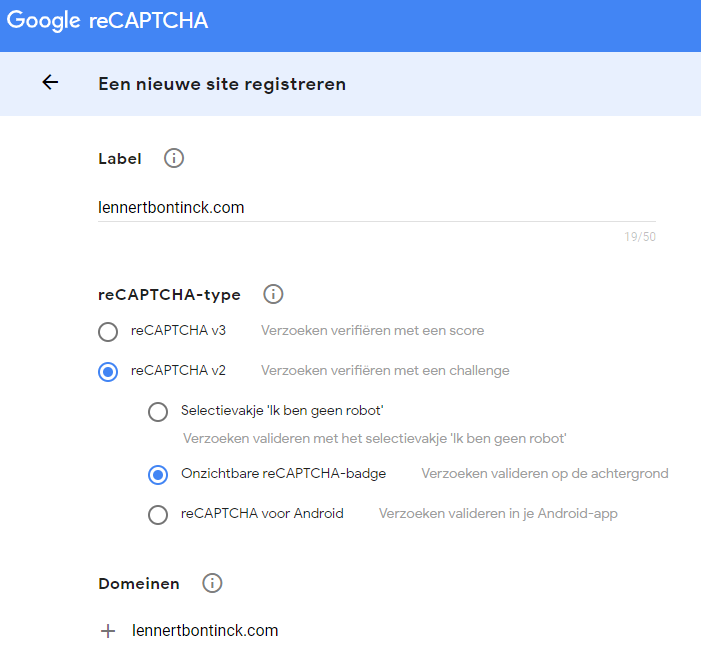
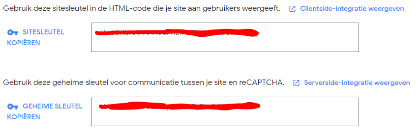
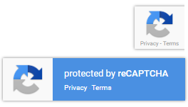
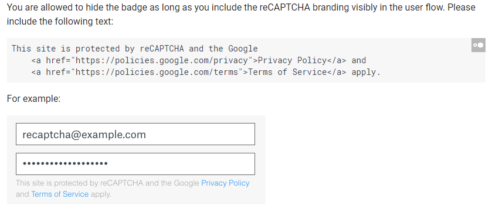

# PHP driven form reCAPTCHA validation tutorial (With AJAX)

This is a small github repo with a step by step tutorial how to implement a Google invisible reCAPTCHA (v2) to an existing php form. 

We will also discuss how you can implement a callback function to trigger what otherwise would be an AJAX call on your (eg) contact.php to hide a contact form after successfully sending an email and showing a success message in it's place.

A working example can be found on my website's contact form:
> https://www.lennertbontinck.com/index.php#contact


## Table of contents

> - [Developer](#developer)
> - [Pre reCAPATCHA setup](#pre-recapatcha-setup)
> - [Wanted result](#wanted-result)
> - [Getting the required free reCAPTCHA keys](#getting-the-required-free-recaptcha-keys)
> - [Required code in our form (HTML)](#required-code-in-our-form-html)
>   - [Importing the required dependencies](#importing-the-required-dependencies)
>   - [Adding an invisible reCAPTCHA to the form](#adding-an-invisible-recaptcha-to-the-form)
>   - [Complete form](#complete-form)
>   - [Overriding the submit of the form](#overriding-the-submit-of-the-form)
>   - [The callback function](#the-callback-function)
> - [Required code server sided (PHP)](#required-code-server-sided-php)
>   - [Validating we received all required params](#validating-we-received-all-required-params)
>   - [Checking if our captcha is valid](#checking-if-our-captcha-is-valid)
> - [Is it allowed to remove the ReCAPTCHA badge in the bottom right corner?](#is-it-allowed-to-remove-the-recaptcha-badge-in-the-bottom-right-corner)
> - [Removing the ReCAPTCHA badge in the bottom right corner (optional)](#removing-the-recaptcha-badge-in-the-bottom-right-corner-optional)
> - [Common problems](#common-problems)
> - [I receive an image validating reCAPTCHA instead of an invisble one](#i-receive-an-image-validating-recaptcha-instead-of-an-invisble-one)
> - [Used sources](#used-sources)


## Developer

| Name     | GitHub                        | Email                               |
| :---     | :---                          | :---                                |
| Bontinck Lennert | [GitHub Lennert](https://www.github.com/pikawika) | [info@lennertbontinck.com](mailto:info@lennertbontinck.com) |


## Pre reCAPATCHA setup

We will be changing an existing contact form which uses AJAX to show a succes message after an email is succesfully send. Our environment before implementing reCAPTCHA looks like this:

- initial form
	- <kbd></kbd>
- succesfully send 
	- <kbd></kbd>


## Wanted result

- Keep the contact form easy to use due to an invisible reCAPTCHA which requires no input most of the time.
- Use a simple image clicking reCAPTCHA if user is suspected to be a bot.
- Stop a LOT (almost all) of bots from using our php driven (eg contact) form.
- Hide the ugly reCAPTCHA overlay yet will still be allowed by google by adding our own disclaimer.
- Still trigger the previous mentioned ajax function to hide the contact form and show a succes message.


## Getting the required free reCAPTCHA keys

- Go to [the Recaptcha admin panel](https://google.com/recaptcha/admin).
- Sign in with a google account if not already logged in. You can have multiple free keys on one account
- You should see a form "register a new site"
	- <kbd></kbd>
	- Choose invisible
	- Fill in all of the domains you want to use the current key for
		- eg: lennertbontinck.com 
	- Accept the reCAPTCHA Terms of Service.
- if everything is correct you should see a screen with your
	- Site key
	- Secret key
	- <kbd></kbd>


## Required code in our form (HTML)

For the reCAPTCHA to work we need to manually write some code in our HTML file.  Luckily this code is pretty universal so should be copy-pastable from these instructions.

### Importing the required dependencies

Include the following scripts tag to your html webpage which has the form on it

```html
<!-- JQuery - I downloaded this locally -->
<script src="assets/js/jquery-1.12.4.min.js"></script>
<!-- ReCAPTCHA  -->
<script src='https://www.google.com/recaptcha/api.js'></script>
```

### Adding an invisible reCAPTCHA to the form

Add the invisible reCAPTCHA to the form as followed, notice we need to change the "YOUR_SITE_KEY" value and can choose a different function name in our callback:

```html
<div class="g-recaptcha"
     data-sitekey="YOUR_SITE_KEY"
     data-size="invisible"
     data-callback="formSubmit">
</div>
```

<small>!!! YOUR_SITE_KEY refers to the site key you received from the previous step [Getting the required free reCAPTCHA keys](#getting-the-required-free-recaptcha-keys) </small>

<small>!!! formSubmit refers to the function name of a function we will create in a next step</small>

### Complete form

The above steps is everything we need to add within the form tag, beneath you can see my whole form tag for comparison purposes. I'm using session variables to remember language preference and choose corresponding text to be displayed, this was here before adding reCAPTCHA and you shouldn't worry about this in your project.

```html
<form method="post" lang='<?php echo $_SESSION['lang'] ?>' id="contact-form" enctype="multipart/form-data">
    <div class="row">
        <div class="form-group col-md-12 wrap-inputGlowed">
            <input type="text" name="cf_name" class="form-control inputGlowed" id="first-name" placeholder="<?php echo $contactStaticText->fieldName ?>" required="required">
            <span class="focus-inputGlowed"></span>
        </div>
        <div class="form-group col-md-12 wrap-inputGlowed">
            <input type="email" name="cf_email" class="form-control inputGlowed" id="email" placeholder="<?php echo $contactStaticText->fieldEmail ?>" required="required">
            <span class="focus-inputGlowed"></span>
        </div>
        <div class="form-group col-md-12 wrap-inputGlowed">
            <input type="text" name="cf_subject" class="form-control inputGlowed" id="subject" placeholder="<?php echo $contactStaticText->fieldSubject ?>" required="required">
            <span class="focus-inputGlowed"></span>
        </div>
        <div class="form-group col-md-12 wrap-inputGlowed">
            <textarea rows="6" name="cf_message" class="form-control inputGlowed" id="description" placeholder="<?php echo $contactStaticText->fieldMessage ?>" required="required"></textarea>
            <span class="focus-inputGlowed"></span>
        </div>
        <div class="g-recaptcha"
             data-sitekey="YOUR_SITE_KEY"
             data-size="invisible"
             data-callback="formSubmit">
        </div>
        <div class="col-md-12">
            <div class="actions">
                <input type="submit" value="<?php echo $contactStaticText->buttonSend ?> "id="submitButton" class="btn btn-lg btn-contact-bg  wow wowRepeat fadeInRight" data-wow-delay=".2s" title="<?php echo $contactStaticText->buttonSend ?>"/></div>
            <p style="font-size: 9px !important;">This site is protected by reCAPTCHA and the Google
                <a href="https://policies.google.com/privacy">Privacy Policy</a> and
                <a href="https://policies.google.com/terms">Terms of Service</a> apply.
            </p>
        </div>

    </div>
</form>
```

### Overriding the submit of the form

Now that our form is prepared we need to override the submit function of our form so we can post the reCAPTCHA to google's servers and stop the forms default behaviour. We will be using jQuery for this. For demonstration purposes i wrote this at the bottom of my html file in a script tag.

```html
 $('#contact-form').submit(function (event) {
        event.preventDefault();
        grecaptcha.reset();
        grecaptcha.execute();
    });
```

<small>contact-form is the id of my form, this might be different in your case.</small>

### The callback function

In one of the previous steps we included the invisible reCAPTCHA  and gave it a callback function using the data-callback attribute. we named the function formSubmit and need to implement it. For demonstration purposes i wrote this at the bottom of my html file in a script tag.

The most important thing here is the fact we need to pass the response from our reCAPTCHA  post to our php URL (eg contact.php) as well as our other form variables. 

On success I'm showing the message my PHP server responded by using an animation and showing it where the form used to be.

```html
    function formSubmit(response) {
        $.ajax({
            url: "/php_files/index/contact.php",
            type: "POST",
            data: {
                cf_name: $("#first-name").val(),
                cf_email: $("#email").val(),
                cf_message: $("#subject").val(),
                cf_subject: $("#description").val(),
                cf_ReCaptchaToken: response
            },
            success: function (result) {
                $("form#contact-form").slideUp("fast", function () {
                    $(this).before('<div class="success text-center">' + result + "<h4></h4></div>"), $("#loader").hide()
                })
            }
        })
    }
```


## Required code server sided (PHP)

For the reCAPTCHA to work we need to manually write some code in our PHP file as well. Luckily this code is pretty universal so should be copy-pastable from these instructions. 

We will simply be checking if the Captcha is correct, in which case we will just continue our php script like before, otherwise we will be showing an alert for demonstration purposes but you can easily implement your own needed logic here.

### Validating we received all required params

we can perform a simple if check to check if we received all params we needed. You probably have something for this already, all you need to do is add a check on the reCAPTCHA  value

```php
//check empty fields
if (empty($_POST['cf_name']) ||
    empty($_POST['cf_email']) ||
    empty($_POST['cf_message']) ||
    empty($_POST['cf_subject']) ||
    empty($_POST['cf_ReCaptchaToken'])
) {
    ?>
    <script language="javascript" type="text/javascript">
        alert('Some of the required fields have been left open. Please fill them in!');
        window.location = '/index.php';
    </script>
    <?php
    return false;
}
```

<small>The most important thing here is the empty($_POST['cf_ReCaptchaToken'] check </small>

### Checking if our captcha is valid

We need to post the captcha to google server for validation, you can copy paste the following function to do just that. Remember to replace YOUR_SECRET_KEY with the secret key you received from a previous step [Getting the required free reCAPTCHA keys](#getting-the-required-free-recaptcha-keys)

```php
function post_captcha($user_response)
{
    $fields_string = '';
    $fields = array(
        'secret' => 'YOUR_SECRET_KEY',
        'response' => $user_response
    );
    foreach ($fields as $key => $value)
        $fields_string .= $key . '=' . $value . '&';
    $fields_string = rtrim($fields_string, '&');

    $ch = curl_init();
    curl_setopt($ch, CURLOPT_URL, 'https://www.google.com/recaptcha/api/siteverify');
    curl_setopt($ch, CURLOPT_POST, count($fields));
    curl_setopt($ch, CURLOPT_POSTFIELDS, $fields_string);
    curl_setopt($ch, CURLOPT_RETURNTRANSFER, True);

    $result = curl_exec($ch);
    curl_close($ch);

    return json_decode($result, true);
}
```

We can now simply call this function with the post value supplied by our HTML.

```php
// Call the function post_captcha with user reCAPTCHA token
$res = post_captcha($_POST['cf_ReCaptchaToken']);
```

That's it! You can now simply check $res['success'] variable which will be true if the user is valid according to our reCAPTCHA!

```php
if (!$res['success']) {
    ?>
    //demonstration purpose alert to tell user captcha is invalid
    <script language="javascript" type="text/javascript">
        alert('Spam filter detected you are a bot!');
        window.location = '/index.php';
    </script>
    <?php
    return false;
} else {
    //your code here!
```

## Is it allowed to remove the ReCAPTCHA badge in the bottom right corner?

!!! CHECK FAQ IF REMOVING BADGE IS STILL ALLOWED !!!

You will probably have noticed an ugly Recaptcha badge after adding the script tag with the reCAPATCHA API. The badge i'm talking about is the following:

> <kbd></kbd>


If we look at google's FAQ we can see it is allowed to remove the reCAPTCHA badge when and only when we mention the use of reCAPTCHA with a specific format:

> <kbd></kbd>


## Removing the ReCAPTCHA badge in the bottom right corner (optional) 

Simply add the following css to your style.css or include it in style tags

```html
<!-- Hide reCAPTCHA badge -->
<style>
    .grecaptcha-badge {
        display: none;
    }
</style>
```


Now add the required usage of reCAPATCHA anywhere near your form where you use the reCAPATCHA, in this example we'll place it underneath the submit button.

```html
<p style="font-size: 9px !important;">This site is protected by reCAPTCHA and the Google
    <a href="https://policies.google.com/privacy">Privacy Policy</a> and
    <a href="https://policies.google.com/terms">Terms of Service</a> apply.
</p>
```


This will hide the badge and show the following subtext on your contact form.

> <kbd></kbd>

## Common problems 

Whenever you're encountering problems always check the following:

- Are you testing the code locally? This won't work since we specified which domains our key is allowed to be used on. 
  - If you want to test the code before putting it online you can create a test subdomain for testing purposes
- Did you replace all values with the ones you need
  - Check if your code doesn't contain stuff like YOUR_KEY_HERE, this should be replaced by your actual key
  - Check if your code doesn't contain variable names from my project
    - eg the php var cf_ReCaptchaToken is a name I used in this demo, if you changed this somewhere  you should change it occurrence everywhere

## I receive an image validating reCAPTCHA instead of an invisble one

Google's invisible reCAPATCHA only works when it's sure you're not a bot, if it ever doubts that it will show an image reCAPATCHA. When testing your code you post a lot of request in a short time period which often causes an additional reCAPATCHA to appear to validate you're not a bot.


## Used sources

- [Clean html mail to send using php](https://github.com/pikawika/contact-form-mail-template)
- [Recaptcha FAQ](https://developers.google.com/recaptcha/docs/faq)

* * *
© [Bontinck Lennert](https://www.lennertbontinck.com/)